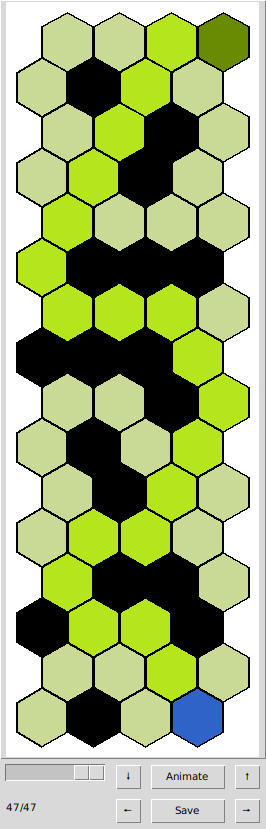
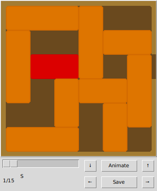

# CEN353: Artificial Intelligence Homework
List of exercises:
1. Flip puzzle
2. 15 puzzle
3. Hex maze
4. Unblock me

### CLI:

>To get command help:

    $ python . --help
  

    usage: . [-h] [--exercise EXERCISE] [--gui] [--stdin] [--input INPUT] [--stdout] [--output OUTPUT] [--algorithm ALGORITHM]

    Run the exercises

    options:
    -h, --help            show this help message and exit
    --exercise EXERCISE   The exercise number to run
    --gui                 Enable GUI?
    --stdin               Use stdin for input
    --input INPUT         Use the given file for input
    --stdout              User stdout for output
    --output OUTPUT       User the given file for output
    --algorithm ALGORITHM
                            Specify the algorithm (lfs, dfs, astar (with specified heuristic), uniform

 

> How to run specific exercise with input file and stdout output and no gui?

    $ python . --exercise $ex_num --input $in_path --stdout

> How to run with GUI?

Add the _--gui_ flag.

## Exercise 1: Flip Puzzle
In this exercise, a 3 by 3 grid is filled with 1 or 0. A legal move picks a cell and flips it and its neighbors (sharing an edge). The goal is to achieve an all 1 configuration.

> **Input specification**:
> The grid as is, columns separated by spaces, rows by newlines.

> **Output specification**:
> The number of steps, and the steps begining with S, and follow with the coordinate of the flip (row and column)

### Running on *input1.txt*:

**Command**

    $ python . --exercise 1 --input flip_puzzle/inputs/input1.txt --stdout --gui --algorithm bfs

**Output**

    6
    S
    4
    2
    8
    6
    9

**GUI**

## Exercise 2: Fifteen puzzle

This is the classic 15 puzzle.

> **Input specifcation**:
> The grid as is, columns separated by spaces, rows by newlines.

> **Output specification**:
> The number of steps, and the tiles switched with blank.

> **A\* heuristic**: Manhattan distance.

### Running on *input1.txt*:

**Command**

    $ python . --exercise 2 --input fifteen_puzzle/inputs/input1.txt --stdout --gui --algorithm astar

**Output**

    13
    S
    2
    10
    8
    11
    10
    7
    3
    2
    6
    10
    11
    12

**GUI**

### Running on *input2.txt*

**Command**

    $ python . --exercise 2 --input fifteen_puzzle/inputs/input2.txt --stdout --gui --algorithm astar

**Output**

    No solution

## Exercise 3: Hex Maze
This is a typical maze implementation, but the grid is hexagonal, with the following coordinate system:

> **Input specification**:
> The first row of the input file will contain the
dimensions of the grid (columns and rows). The second row will contain
the coordinates of thestarting point (entrance). The
third row will contain the coordinates of the goal (the
exit). The fourth row will contain the number of
blocked hexagons in the labyrinth. The following
rows will contain the coordinates of the blocked
hexagons.

> **Output specification**:
> Number of steps, the starting state and the coordinates visited

> **A\* heuristic**:
> Hexagonal distance

### Running on *input1.txt* with A\*

**Command**

    $ python . --exercise 3 --input hex_maze/inputs/input1.txt  --stdout --gui --algorithm astar

**Output**

    21
    S
    14 2
    13 2
    13 1
    12 0
    11 1
    11 2
    10 2
    9 3
    8 3
    7 3
    6 2
    6 1
    6 0
    5 0
    4 0
    3 1
    2 1
    1 2
    1 3
    0 3

**GUI start state**

**GUI goal state**

### Running on *input1.txt* with BFS:

**GUI goal state**

### Running on *input1.txt* with DFS:

**GUI goal state**

## Exercise 4: **_Unblock me_** puzzle

In this exercise, our goal is to free a tile in a 6x6 grid that is constrained by the position of the other similar tiles. The legal moves are the sliding positions, and also a special "exit" move for the main tile (when its path is unobstructed).

> **Input specification**:
> The first row contains the number of tiles. Then following we have the tile specifications, beginning with the main tile. Each tile is a 4 tuple, the first element being the axis (V or H), the position of the leftmost or uppermost tile, and the length.

> **Output specification**:
> First we have the number of state. Then we have the "S" state, followed by the legal tile moves, which contain the tile position, the distance moved, and the direction "U", "R", "D", "L"

> **A\* heuristic**:
> Number of unobstructed steps in the main tile's path towards the exit.

### Running on *input1.txt* with A\*:

**Command**

    python . --exercise 4 --input unblock_puzzle/inputs/input1.txt  --stdout --gui --algorithm astar

**Output**

    19
    S
    0 2 1 D
    0 3 1 D
    0 4 2 L
    1 4 1 U
    3 4 1 U
    4 2 2 R
    1 2 2 D
    1 3 2 D
    2 0 2 R
    3 1 3 U
    2 2 2 L
    3 2 2 U
    3 3 2 U
    4 4 4 L
    1 2 2 D
    1 3 2 D
    2 4 1 D
    2 0 6 R

**GUI (start and goal)**

### Running on *input2.txt* with A\*:

> Hard!

**GUI (start and goal)**

### Running on *input3.txt* with A\*:

> Hard!

**GUI (start and goal)**

